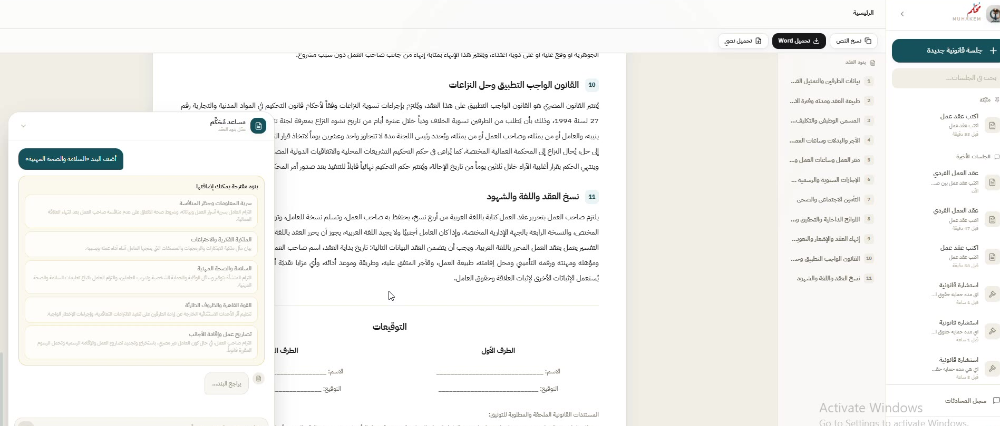
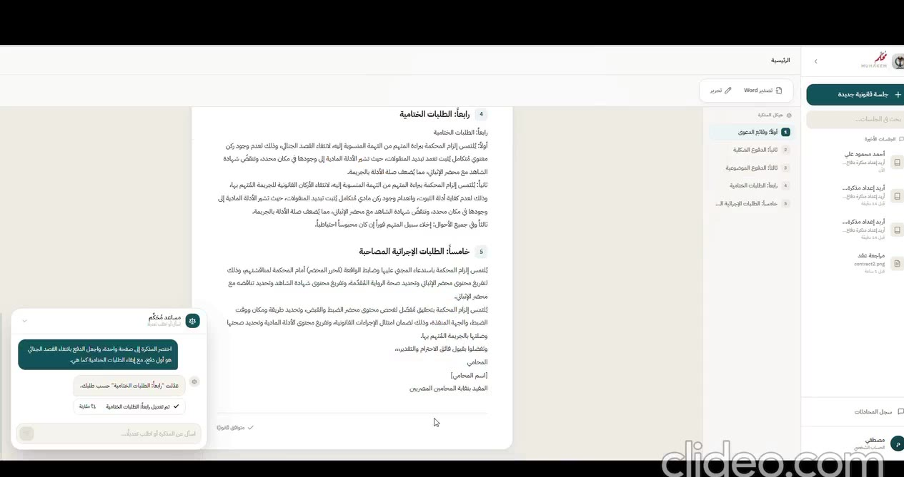
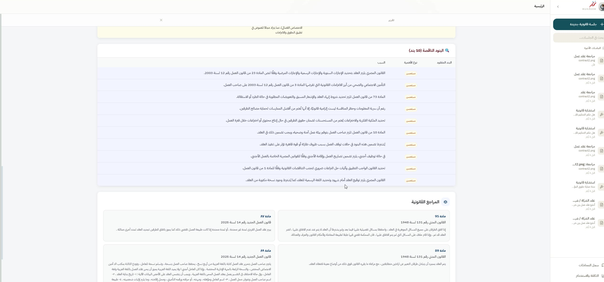

# Muhakem Legal AI · مُحكِّم

<p align="center">
  <strong>Arabic-first legal intelligence for Egyptian legal workflows.</strong><br />
  <sub>Research · Consultation · Drafting · Review</sub>
</p>

<p align="center">
  <a href="https://hebaomran29.github.io/muhakem-legal-ai-showcase/">Live Demo</a> ·
  <a href="./docs/Muhakem_Project_Summary.pdf">Project Summary</a> ·
  <a href="https://github.com/hebaomran29/muhakem-legal-ai">Private source repository</a>
</p>

> **Public showcase only.** This repository presents the product concept, selected sanitized interface captures, and a static demonstration. The full application source, legal corpus, user data, credentials, model weights, and runtime databases remain private.

---

## العربية

### نبذة عن المشروع

**مُحكِّم** منصة عربية للذكاء الاصطناعي القانوني، صُممت لمساعدة المحامي والباحث القانوني في الوصول إلى المعلومة، إعداد المستندات، ومراجعة البنود داخل مساحة عمل واحدة. يركز المشروع على السياق القانوني المصري وعلى جعل المخرجات قابلة للفحص والتعديل بدل عرض النص المولد باعتباره رأيًا قانونيًا نهائيًا.

### المسارات الرئيسية

| المسار | ما الذي يقدمه؟ |
| --- | --- |
| الاستشارة القانونية | إجابات عربية منظمة مبنية على مواد قانونية مسترجعة ومراجع مرتبطة بالسياق. |
| إنشاء العقود | صياغة عقد منظم مع إمكانية تعديل البنود أو إضافتها أو حذفها بندًا بندًا. |
| مذكرات الدفاع | تحويل الوقائع والأدلة والدفوع إلى مذكرة دفاع قابلة للمراجعة. |
| مراجعة العقود | استخراج البنود وتحليلها وإظهار إشارات المخاطر والثقة والأساس القانوني. |
| تحليلات الاستخدام | تتبع التوكنز، زمن الاستجابة، وعدد العمليات للمقارنة بين التشغيل المحلي والسحابي. |

### فيديوهات ولقطات من التطبيق

تتضمن صفحة الـDemo فيديوهات قصيرة حقيقية لمسارات الاستشارة، إنشاء العقود، مذكرات الدفاع، ومراجعة العقود. تم استخدام `preload="metadata"` وposter لكل فيديو حتى لا يتم تحميل المقاطع كاملة عند فتح الصفحة.

| المسار | الفيديو |
| --- | --- |
| الاستشارة القانونية | [`consultation.mp4`](./assets/screenshots/consultation.mp4) |
| إنشاء العقود | [`contract-generation.mp4`](./assets/screenshots/contract-generation.mp4) |
| مذكرة الدفاع | [`defense-memo.mp4`](./assets/screenshots/defense-memo.mp4) |
| مراجعة العقد وOCR | [`contract-review.mp4`](./assets/screenshots/contract-review.mp4) |


<p align="center">
  
  
</p>
<p align="center">
  
  
</p>

### البنية البحثية

يفصل النظام بين الواجهة، طبقة الـAPI، التوجيه، الاسترجاع، التوليد، ومعالجة المستندات والتحقق. يدعم التصميم أوضاع التشغيل Online وHybrid وLocal بحسب متطلبات الخصوصية والبنية التحتية.

```text
React / Vite workspace
        ↓
FastAPI orchestration layer
        ↓
Qdrant hybrid retrieval + legal metadata
        ↓
LLM generation + validation + document export
```

### الخصوصية والتنبيه القانوني

هذا المستودع عام للعرض فقط. لا يجب رفع مفاتيح API، ملفات `.env`، مستندات قانونية حقيقية، سجلات مستخدمين، قواعد SQLite، بيانات Qdrant، ملفات OCR، أوزان نماذج، أو أي كود من المستودع الخاص. مُحكِّم نموذج بحثي وبرمجي، ومخرجاته لا تُعد بديلًا عن مراجعة محامٍ مؤهل أو الرجوع إلى المصادر الرسمية.

---

## English

### Project overview

**Muhakem** is an Arabic-first legal-AI workspace designed for Egyptian legal workflows. It brings legal research, consultation, contract drafting, defense-memorandum generation, and contract review into one source-aware experience. The product concept is built around professional review: users can inspect references, refine generated text, and retain responsibility for the final legal reasoning.

### Core workflows

| Workflow | Purpose |
| --- | --- |
| Legal consultation | Structured Arabic answers grounded in retrieved legal material and contextual references. |
| Contract generation | Editable drafting with clause-level addition, modification, and deletion. |
| Defense memoranda | Case-fact structuring, legal retrieval, and reviewable memorandum generation. |
| Contract review | OCR-assisted extraction, clause analysis, risk signals, and legal-basis display. |
| Usage analytics | Token, latency, operation, and estimated cloud-cost tracking for evaluation. |

### Product architecture

Muhakem separates the user experience from routing, retrieval, generation, document processing, and validation. This makes the prototype adaptable to online, hybrid, or local deployment while keeping the product surface consistent.

| Layer | Role |
| --- | --- |
| Frontend | React/Vite workspace for the legal workflows and usage dashboard. |
| Backend | FastAPI orchestration and session services. |
| Retrieval | Qdrant hybrid search, embeddings, lexical retrieval, and legal metadata. |
| Generation | Qwen/Ollama or compatible online model providers. |
| Document processing | OCR, clause chunking, validation, and editable document export. |

### Repository contents

| Path | Description |
| --- | --- |
| [`index.html`](./index.html) | Static public product showcase. |
| [`style.css`](./style.css) | Responsive visual system for the showcase page. |
| [`assets/screenshots/`](./assets/screenshots/) | Sanitized interface captures and product-demo videos. |
| [`docs/Muhakem_Project_Summary.pdf`](./docs/Muhakem_Project_Summary.pdf) | Four-page project summary covering the required submission sections. |
| [`assets/favicon.png`](./assets/favicon.png) | Transparent public brand mark. |

### Run locally

The showcase is a static site and requires no backend or API key. Open `index.html` directly in a browser, or serve the repository with any static HTTP server. The live version is published through GitHub Pages:

**[hebaomran29.github.io/muhakem-legal-ai-showcase](https://hebaomran29.github.io/muhakem-legal-ai-showcase/)**

### Team

Muhakem was developed as a graduation project by **Heba Reda Mohamed Omran, Manal Gamil Hassan Alaaeldin, Omnia Mahfouz Abdellatif Mostafa, Nehal Hammam Hassan Abdelhamed, and Mariam Magdy Abdo Mohamed Elatbany**, under the supervision of **Prof. Ghazal Abdelaty Fahmy**, within the Digilians 9 Months Diploma in AI and Data Science.

### Disclaimer

Muhakem is a research and software prototype. It is not a substitute for advice from a qualified lawyer. Generated content must be checked against applicable legislation, official sources, and the facts of the individual matter.

---

<p align="center"><sub>© Muhakem team · Public showcase · August 2026</sub></p>
