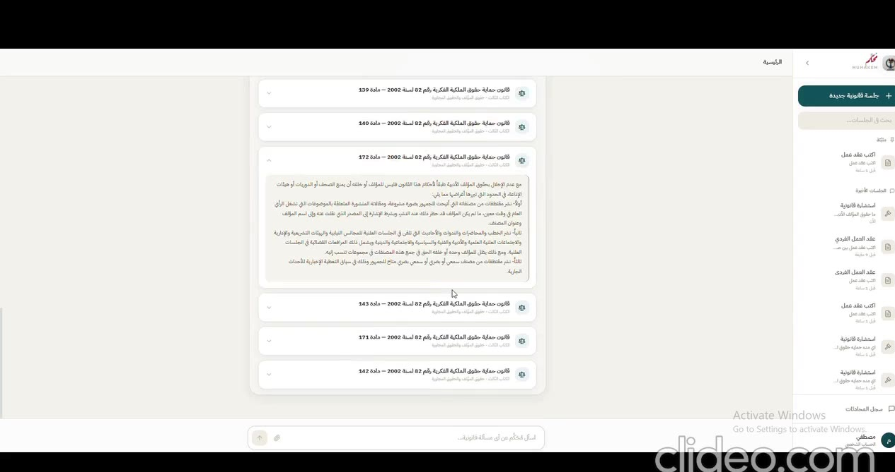

# Muhakem Legal AI | مُحكِّم للذكاء الاصطناعي القانوني

[العربية](#العربية) · [English](#english) · [Live Demo](https://hebaomran29.github.io/muhakem-legal-ai-showcase/)

<a id="العربية"></a>

## العربية

**مُحكِّم** منصة عربية للذكاء الاصطناعي القانوني تساعد المتخصصين في البحث القانوني، وإنشاء العقود، وإعداد مذكرات الدفاع، ومراجعة المستندات القانونية مع إظهار المراجع ذات الصلة.

> هذا المستودع نسخة عرض عامة فقط. الكود الكامل للمنصة، والـBackend، وقاعدة البيانات القانونية، وبيانات المستخدمين، ومفاتيح الخدمات، وملفات النماذج محفوظة في مستودع خاص وغير موجودة هنا.

### فكرة المشروع

تجمع المنصة بين فهم اللغة العربية، والاسترجاع المعزز بالتوليد، ومعالجة المستندات، وتجربة عمل واحدة موجهة للمحامي والباحث القانوني. الهدف هو تقليل الوقت اللازم للوصول إلى المعلومة وصياغة المستند، مع الحفاظ على إمكانية مراجعة المصدر وعدم تقديم النص المولد باعتباره رأيًا قانونيًا نهائيًا.

### المسارات الرئيسية

| المسار | الوظيفة |
| --- | --- |
| الاستشارة القانونية | طرح أسئلة قانونية باللغة العربية والحصول على إجابة منظمة مبنية على النصوص المسترجعة. |
| إنشاء العقود | إنشاء عقد منظم وإضافة البنود أو تعديلها أو حذفها من خلال مساعد تفاعلي. |
| إعداد مذكرة دفاع | تحويل الوقائع والأدلة والدفوع والطلبات إلى مذكرة دفاع قابلة للمراجعة. |
| مراجعة العقد | استخراج البنود وتحليلها وإظهار المراجع ومؤشرات الثقة والتنبيهات. |
| مراقبة الاستخدام | تسجيل عدد التوكنز، وزمن الاستجابة، وتقسيم الاستخدام، والتكلفة السحابية التقديرية. |

### العرض المباشر

يمكن فتح [صفحة الـDemo العامة](https://hebaomran29.github.io/muhakem-legal-ai-showcase/) مباشرة. الصفحة ثابتة وتستخدم أمثلة خيالية، ولا تتصل بقاعدة بيانات أو نموذج ذكاء اصطناعي أو مستندات مستخدمين.

### إضافة لقطات شاشة حقيقية

تُحفظ لقطات الشاشة العامة داخل مجلد `assets/screenshots/`، ثم تُضاف إلى هذه الصفحة أو إلى `index.html` بمسارات نسبية، مثل:

```markdown

```

قبل رفع أي صورة، يجب إخفاء أسماء المستخدمين، والمفاتيح، وعناوين البريد، وأرقام القضايا، والمستندات الحقيقية، وأي بيانات شخصية أو سرية. يمكن تصدير الصور من Canva بصيغة PNG، أو أخذ Screenshots من التطبيق نفسه، ثم رفع الملفات المنقحة إلى مجلد الصور فقط.

### الجانب البحثي والهندسي

يعتمد التصميم على فصل طبقات الواجهة، والـAPI، والاسترجاع، والتوليد، ومعالجة المستندات. ويسمح هذا الفصل بتشغيل المنصة في وضع Online أو Hybrid أو Local دون إعادة تصميم تجربة المستخدم.

```text
واجهة React
    ↓
FastAPI API
    ↓
استرجاع قانوني + نموذج لغوي + معالجة مستندات
    ↓
إجابة أو مستند منظم مع مراجع
```

### الخصوصية والتنبيه القانوني

لا ترفعي إلى هذا المستودع أي مفاتيح API، أو ملفات `.env`، أو مستندات قانونية، أو سجلات مستخدمين، أو قواعد SQLite، أو مجموعات Qdrant، أو ملفات OCR، أو أوزان النماذج، أو الكود الخاص بالمنصة. مُحكِّم نموذج بحثي وبرمجي، ومخرجاته لا تُعد بديلًا عن استشارة محامٍ مؤهل.

<a id="english"></a>

## English

**Muhakem** is an Arabic-first legal-AI workspace for legal research, contract drafting, defense-memo generation, document review, legal references, and usage analytics.

> This repository is a public presentation showcase only. The full application source, backend, legal corpus, user data, credentials, and model files are intentionally excluded.

### Product idea

Muhakem combines Arabic language understanding, retrieval-augmented generation, document processing, and a focused legal workspace. Its goal is to reduce the time required to find relevant material and prepare structured documents while keeping source review visible.

### Main workflows

| Workflow | Purpose |
| --- | --- |
| Legal consultation | Arabic legal questions with answers grounded in retrieved legal material. |
| Contract generation | Structured drafting with interactive clause addition, editing, and deletion. |
| Defense memos | Organized memoranda built from facts, evidence, defenses, and requests. |
| Contract review | Document extraction, clause analysis, legal references, and confidence indicators. |
| Usage analytics | Token counts, latency, operation breakdown, and estimated cloud-cost comparison. |

### Live Demo

Open the [public live Demo](https://hebaomran29.github.io/muhakem-legal-ai-showcase/). It is a static presentation page using fictional examples and does not connect to a production backend or user documents.

### Adding real screenshots

Place sanitized screenshots in `assets/screenshots/` and reference them with relative paths. Screenshots may be exported from Canva as PNG files or captured from the application. Remove all personal information, credentials, case numbers, private documents, and confidential interface details before publication.

### Privacy and disclaimer

Never commit API keys, `.env` files, legal documents, user records, SQLite databases, Qdrant data, OCR caches, model weights, or private source code. Muhakem is a research and software prototype and is not a substitute for advice from a qualified lawyer.

## Private source repository

The complete implementation is maintained separately in a private repository while the project is under development and evaluation.
